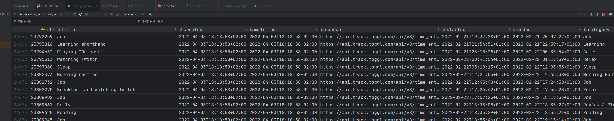
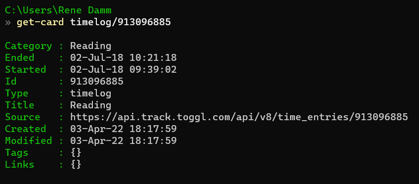

# GulperIndex

This is a real-time indexing system for a database of "cards". Each card is a JSON document that is stored as a flat file in a folder structure. This separates database storage (just a bunch of loose files that can be edited and backed up any which way, e.g. Dropbox) from database structure (the actual database maintained on the fly by the server). The database can be queried through a REST interface provided by the server.

The server is implemented in Rust. This was mainly to get my feet wet in the language and see what the hype is about :)

## Cards

The idea here goes back quite a bit. What started bothering me is that there are all these online services that each maintain a part of your collective data set. For example, Fitbit may be storing sleep, exercise and activity data, OneDrive may be storing your pictures and videos, Gmail may be storing your messages, Dropbox may be storing your files, Toggl may be storing your time-tracking, your bank is storing all your money in- and outflows, Amazon may be storing a significant part of your purchase history, and so on. And at any point, any of these services may disappear or get replaced.

I wondered whether there couldn't be a good way to just suck all the data out of these services and store it all in one, easily (mechanically) digestible form. Which led to the concept of "cards".

A card is just a JSON document. There's some common fields but otherwise, each type of card is free to define its structure and new types can be added at any point. And these documents are simply stored on disk as flat JSON files. Which means they can not only be backed up easily but can even be put under Git version control trivially.

Also, these are easy to create from any script or programming language. Which makes it easy to write scraping tools that convert data from external services into cards.

Here's a typical card. This one's a "timelog" entry, i.e. time tracking data (here, converted from [Toggl](https://toggl.com)).

```json
{
  "Id": 913096885,
  "Ended": "2018-07-02T10:21:18+02:00",
  "Tags": [],
  "Category": "Reading",
  "Modified": "2022-04-03T18:17:59+02:00",
  "Title": "Reading",
  "Source": "https://api.track.toggl.com/api/v8/time_entries/913096885",
  "Links": [],
  "Type": "timelog",
  "Started": "2018-07-02T09:39:02+02:00",
  "Created": "2022-04-03T18:17:59+02:00"
}
```

Which then goes into a queryable table in GulperIndex.



Which then can be retrieved through the REST API (here, boringly, just by ID but more complex forms of querying are available). `Get-Card` in this case is a simple custom PowerShell function that wraps the API endpoint.



Every modification of the files and folders on disk automatically rebuilds the database. And also automatically updates a "daily report" using R Markdown.

## Okay... so how did this work out?

Well, it works fine but the system proved too clunky in practice and just plain added too little value. Or maybe I just never got it to the point where it all came together. Either way, it sits there mostly unused these days :/

